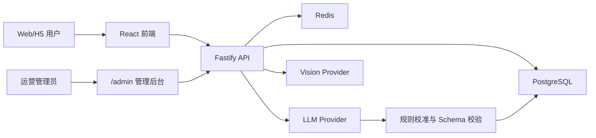

# JobLens 项目面试高通过率实战指南

> 目标：帮助候选人把项目讲清楚、讲深入、讲真实。本文不能保证面试结果，但能显著减少“只会调用模型”“技术堆砌”“数据造假”和“追问后自相矛盾”四类失分。

## 1. 一页结论

### 1.1 项目是什么

JobLens 是面向求职者的岗位风险决策工具。用户可以粘贴 JD、HR 对话，或上传招聘截图；系统输出风险等级、原文证据、缺失信息、建议追问和行动建议。

它解决的不是“帮用户总结 JD”，而是三个连续问题：

1. 招聘信息是否透明，是否存在岗位包装、收费、培训贷或职责与薪资不匹配等信号？
2. 当前证据是否足够，哪些结论只能标记为“待核实”？
3. 用户下一步应该向 HR 问什么，而不是只得到一个无法行动的分数？

### 1.2 一句话亮点

> 我把一个主观、模糊的求职判断问题，做成了可解释、可校验、可降级、受成本约束的 AI 决策流程。

### 1.3 技术栈

- 前端：React 19、TypeScript、Vite、Tailwind CSS、React Router。
- 后端：Fastify、TypeScript、Zod、Prisma。
- 数据：PostgreSQL、Redis。
- AI：SiliconFlow/Qwen 文本模型、Qwen-VL 视觉模型、规则引擎降级。
- 部署：Vercel 前端、Render API、托管 PostgreSQL/Redis；另支持国内服务器 Docker Compose。
- 工程：GitHub Actions CI、部署工作流、生产巡检、加密备份。

### 1.4 当前真实边界

- 已完成线上 MVP，不等于已经验证大规模商业化。
- 已有典型样本和自动化规则回归，没有足够大的人工标注集，不能宣称准确率 90%。
- 已实现反馈收集和后台审核，尚未把用户反馈自动写入风险权重或训练模型。
- 已实现匿名 visitor 隔离，不是账号体系，也不能替代强身份认证。
- 生产架构能支撑 MVP，未经过大规模并发压测。

## 2. 从用户需求讲产品

### 2.1 目标用户

- 缺少求职经验、难以识别招聘话术的应届生和转行用户。
- 面对模糊头衔、高薪低门槛、职责不清时无法判断的候选人。
- 不知道如何向 HR 核实底薪、绩效、合同主体和真实工作内容的用户。

### 2.2 用户任务（JTBD）

> 当我收到一份看起来不错但信息模糊的岗位时，我希望快速知道哪里值得警惕、依据是什么、下一步该问什么，从而决定是否继续面试。

### 2.3 四个核心痛点

| 痛点 | 传统方式的问题 | JobLens 的解决方式 |
|---|---|---|
| 输入成本高 | 招聘 App 中的长 JD 很难复制 | 截图 OCR 导入并允许确认编辑 |
| 风险信号隐蔽 | 单关键词无法识别组合式包装 | 大模型语义理解 + 组合规则 |
| 结论不可信 | 黑盒分数没有证据 | 强制输出原文证据和置信度 |
| 不知道下一步 | “有风险”不能指导行动 | 生成可直接询问 HR 的问题 |

### 2.4 产品主链路

```text
文本或截图导入
  -> OCR 结果确认与编辑
  -> 岗位风险分析
  -> 查看证据、缺失信息和追问
  -> 核实 HR 回复
  -> 匿名提交面试反馈
  -> 管理后台审核反馈
```

### 2.5 产品设计亮点

#### 证据优先，而不是分数优先

风险分只是扫描入口。真正帮助用户决策的是“输入中的哪句话触发了什么风险”和“还有什么信息缺失”。高风险但没有证据的模型输出会被降级。

#### 信息不足时主动降低确定性

系统不为了显得智能而强行下结论。输入过短或证据不足时，降低置信度、清空不可靠风险类型，并提示补充职责、薪资和 HR 回复。

#### 风险措辞有法律与产品边界

产品不直接断言企业“诈骗”或“违法”，而是使用“信息不透明”“疑似业务性质需确认”“职责与薪资不匹配”等可验证描述。

#### 把结果转化为行动

报告会生成底薪、提成、销售指标、合同主体、社保主体、收费和贷款等追问。用户可以复制问题继续与 HR 沟通。

#### 输入体验形成闭环

OCR 不直接触发分析，而是先回填到表单。用户能纠正模型识别错误，也能为没有具体岗位的招聘海报补充职责。

#### 运营能力不是事后补丁

管理后台覆盖经营总览、分析质量、反馈审核、系统与安全。运营者可以查看模型调用率、风险分布、成本、延迟、失败率和安全事件。

## 3. 系统架构怎么讲



### 3.1 岗位分析请求链路

1. 前端做长度、图片格式和高敏信息即时提示。
2. 后端用 Zod 再次校验，前端校验不作为安全边界。
3. 服务端检查 visitor、IP、输入哈希、每日额度和并发租约。
4. 查询 10 分钟岗位分析缓存。
5. 调用文本模型并解析固定 JSON。
6. 运行强风险规则、反误伤规则和证据校验。
7. 保存报告及调用来源、模型、延迟、Token 和成本估算。
8. 返回 `model`、`cache` 或 `fallback` 来源信息。

### 3.2 OCR 请求链路

1. 前端限制 1 至 3 张 PNG/JPEG/WebP，单张不超过 2MB。
2. 服务端按图片字节、语言、模型和 Prompt 版本计算跨 visitor 缓存键。
3. 未命中缓存时预占 OCR 额度和并发租约。
4. Qwen-VL 提取 JD、公司、岗位、平台和真实 HR 对话。
5. 空选填字段被清理；没有招聘信息时返回 `NO_JOB_INFORMATION`。
6. 高敏个人标识检测通过后，结果进入 24 小时 Redis 缓存。
7. 前端回填表单，用户确认后再分析。

## 4. 技术实现亮点

### 4.1 混合式 AI 风险引擎

```text
LLM 语义理解
  + Zod 结构约束
  + 强风险规则兜底
  + 反误伤规则校准
  + 证据一致性检查
  = 可解释风险报告
```

- 大模型处理“储备主管”“事业部辅助管理”等表达变体。
- 确定性规则处理培训贷、押金、扣证件、先交费等明确风险。
- 反误伤规则避免把薪资与销售指标透明的正常销售岗判成岗位包装。
- 养老/保险泛化岗位采用组合信号，不因单个行业词直接定性。

**推荐表达：**

> 我没有把规则当作模型的替代品，而是把它放在模型输出之后，作为安全边界和业务校准层。

### 4.2 结构化输出治理

- 模型只能输出固定字段，拒绝未知字段。
- 分数限制在 0 至 100。
- 数组数量、字符串长度和总输出规模均受限制。
- 高风险报告必须存在输入证据。
- 无法解析或校验失败的数据不会写入业务表。
- Prompt 将 JD 放入明确的不可信数据边界。

**不要说：**“已经完全解决模型幻觉和 Prompt Injection。”

**安全说法：**“通过数据边界、Schema 和业务规则降低风险，但模型安全需要持续评测。”

### 4.3 Provider 抽象与可降级设计

- 文本模型统一到 Provider 接口。
- 支持 SiliconFlow、QwenCloud 别名和规则 Provider。
- 主模型失败时文本分析可降级为规则报告。
- OCR 无法可靠用规则替代，因此失败时明确停止，不伪造识别结果。
- 响应头记录来源、Provider、模型和延迟，避免“秒回但不知道是否调用模型”。

### 4.4 AI 成本与恶意调用控制

当前默认策略：

| 控制项 | 默认值 |
|---|---:|
| 匿名用户每日 OCR | 3 次 |
| 匿名用户每日分析 | 3 次 |
| IP 每日 OCR | 20 次 |
| IP 每日分析 | 30 次 |
| 全站每日预算 | 300 credits |
| OCR 成本权重 | 3 credits |
| 文本分析成本权重 | 1 credit |
| 全站模型并发 | 4 |
| OCR 并发 | 2 |
| 文本分析并发 | 3 |

Redis Lua 脚本原子完成额度判断与预占，避免并发请求突破上限；并发租约使用有过期时间的 ZSET，进程异常后不会永久占槽。

### 4.5 两级缓存策略

- 岗位分析缓存：10 分钟，避免用户短时间重复提交，同时保证模型调整后不会长期返回旧结论。
- OCR 缓存：24 小时，按图片真实字节跨 visitor 去重，显著减少相同招聘截图的重复付费识别。
- 缓存键包含语言、模型和 Prompt 版本，升级模型或 Prompt 后不会污染新结果。
- 缓存命中不扣 AI 额度。

### 4.6 隐私和数据安全

- 图片只用于当前模型请求，不写入业务数据库或日志。
- OCR 结果、JD、HR 文本在后端做身份证、银行卡和完整手机号检测。
- API 日志不记录输入原文。
- 报告查询和删除同时校验 report ID 与 visitor ID。
- 管理 API 使用独立 `ADMIN_TOKEN`，DTO 不返回 IP、visitor ID、User-Agent 和输入哈希。
- 生产环境要求 PostgreSQL、Redis 可用；依赖异常时 fail closed。

**不要说：**“数据库做了应用层字段加密。”当前代码没有实现这一点。

### 4.7 可观测性和生产工程

- 健康检查覆盖 API、PostgreSQL 和 Redis。
- 记录 API 状态、模型来源、耗时、Token 和成本。
- 每 30 分钟生产巡检前端、后端、权限隔离和预算阈值。
- 生产数据每日加密快照，执行恢复结构校验并保留 14 天。
- 前端运行时错误会上报，管理后台展示成功率、错误、限流和验证码指标。

### 4.8 管理后台

管理后台不是直接连数据库，而是通过受保护的管理 API：

- `/api/admin/overview`：趋势、风险、成本、延迟、预算和依赖。
- `/api/admin/reports`：报告检索、筛选和详情。
- `/api/admin/feedbacks`：面试反馈与报告纠错审核。
- `/api/admin/security`：API 质量和安全事件。

### 4.9 多语言

- 首页、隐私、免责声明、面试反馈和报告页支持中英文。
- 分析请求携带语言，模型可读字段按所选语言生成。
- 风险等级等稳定枚举不随显示语言改变，由前端本地化。
- 报告重新加载继续携带语言，规则降级文本也做确定性本地化。

## 5. 面试开场模板

### 5.1 30 秒版本

> 我独立设计并上线了 JobLens，一款面向求职者的岗位风险分析 Web/H5 产品。用户可以粘贴 JD、HR 对话或上传招聘截图，系统结合视觉模型、大语言模型和规则引擎，输出可回溯证据、信息缺口和可直接追问 HR 的问题。工程上我重点解决了模型结构化输出、误判校准、AI 成本控制、匿名数据隔离、管理后台和低成本生产部署。

### 5.2 2 分钟版本

> 我做这个项目，是因为招聘风险很少是一个明确关键词，更多是多个弱信号的组合。例如“养老事业部辅助管理”本身不能说明问题，但如果同时出现高薪、低经验、职责模糊、没有固定底薪和业务边界，就值得核实。
>
> 产品上，我把流程设计为导入、确认、分析和行动四步。用户可以截图导入，先确认 OCR 文本，再生成风险报告。报告不只给分数，还必须给原文证据、缺失信息和追问建议。这样用户能继续向 HR 核实，而不是被一个黑盒结论吓到。
>
> 技术上，我用了大模型加规则的混合架构。模型负责语义理解，Zod 控制结构，强风险和反误伤规则做二次校准；Redis 负责 10 分钟分析缓存、24 小时跨用户 OCR 去重、每日额度和并发控制。生产端还有 PostgreSQL 持久化、管理后台、监控、备份和中英文支持。当前是完成真实线上闭环的 MVP，但我不会声称已经有大规模用户或准确率数据，下一步重点是建设人工标注评测集和反馈闭环。

### 5.3 5 分钟讲解顺序

1. 用户为什么需要它。
2. 为什么输出“证据 + 追问”，而不是只给风险分。
3. 多模态导入如何降低使用门槛。
4. LLM、Schema、规则和反误伤如何协作。
5. 如何控制成本、攻击和第三方故障。
6. 用一个线上故障或误判案例讲迭代。
7. 主动说清当前边界和下一步。

## 6. 最值得讲的 STAR 案例

### 6.1 包装保险销售岗位漏判

**S：** “养老事业部辅助管理”截图被模型判得过于安全，但用户反馈真实岗位可能涉及保险销售。

**T：** 提高组合式岗位包装的召回，同时避免看到“养老”或“保险”就武断定性。

**A：** 将泛化管理头衔、高薪低经验、职责模糊、业务边界缺失组合判断；输出“疑似业务性质需确认”，补充固定底薪、销售指标、客户开发、代理人招募和合同主体追问；增加反误伤与自动化回归。

**R：** 典型样本会被提升为高风险待核实，同时保持低置信度和证据边界。这个结果证明的是典型场景被修复，不代表整体准确率。

### 6.2 招聘宣传长图 OCR 返回服务不可用

**S：** Gate 招聘海报格式正常，但线上返回 `OCR_UNAVAILABLE`。

**T：** 判断是图片格式、模型故障还是业务 Schema 设计不合理。

**A：** 用原图分别调用线上 API、服务层和 Provider，发现模型识别了公司名，但因没有具体岗位返回空 `jd_text`，严格 Schema 将其统一包装成服务异常。升级 Prompt，让招聘宣传内容进入可编辑文本；清理空字段；将真正无招聘信息改为 `422 NO_JOB_INFORMATION`；Prompt 版本进入缓存键。

**R：** 同一原图线上返回 HTTP 200，约 8.2 秒识别出 Gate 和公司招聘介绍；新增两项解析测试。

### 6.3 模型“秒回”但实际命中缓存

**S：** 用户怀疑模型没有调用，因为报告几乎立即返回。

**T：** 让模型调用、缓存和规则降级可区分。

**A：** 增加分析来源、Provider、模型和延迟响应头；分析缓存缩短至 10 分钟；旧缓存通过命名空间失效。

**R：** 排障从主观猜测变为查看来源数据，同时平衡成本和结果新鲜度。

### 6.4 AI 防刷与成本上限

**S：** OCR 单次成本高，匿名产品容易被脚本更换 visitor 后盗刷。

**T：** 在不引入登录体系的前提下控制最坏成本。

**A：** 叠加 visitor、IP、输入哈希、跨 visitor OCR 缓存、全局 credits 和并发租约；Redis 异常时付费 AI fail closed；前端展示剩余额度。

**R：** 成本从“请求量不可控”变成“每日预算和并发可计算”。代价是共享 IP 用户可能被误伤，需要后续结合账号和风险评分改进。

### 6.5 从 Failed to fetch 到可验证发布链路

**S：** Vercel 前端、Render API、CORS 和免费实例状态不一致，用户只看到 `Failed to fetch`。

**T：** 建立能判断“代码、构建、部署、依赖、跨域”各层状态的链路。

**A：** 修复生产 API 地址和 CORS；工作流轮询真实 deployment ID；加入健康检查、生产巡检、前端错误上报和权限隔离测试。

**R：** CI、部署和生产回归成为独立可验证步骤，故障定位不再只依赖浏览器报错。

## 7. 高频问题与不埋雷答案

### Q1：这是不是大模型套壳？

**推荐回答：**

> 如果只是把 JD 发给模型再展示文本，确实是套壳。这个项目的核心工作是控制模型的不确定性：截图结构化、固定 Schema、证据约束、规则校准、反误伤、缓存与降级、成本上限、隐私隔离和运营审核。模型是一个能力组件，不是全部产品。

**不要回答：**“不是套壳，因为代码很多。”代码量不等于系统价值。

### Q2：为什么不用纯规则？

> 纯规则适合培训贷、押金等明确词，但难覆盖模糊头衔和语义变体。模型提高泛化，规则守住明确风险和产品边界。两者承担不同职责。

### Q3：为什么不用纯大模型？

> 纯模型存在输出漂移、证据缺失、供应商故障和成本不可控。收费、贷款和扣证件等强信号应该由确定性规则拥有校准权。

### Q4：风险分怎么计算？

> 模型先输出总体风险和 JD、HR、企业、反馈四类子维度；可用维度参与动态权重，强风险规则再做修正。当前 MVP 的企业和反馈维度经常是 missing，不会用零分代替。我要强调：现在的分数是决策排序信号，不是统计学概率。

### Q5：怎么证明分析准确？

> 目前能证明典型规则样本和线上链路稳定，不能证明整体准确率。严谨做法是建立脱敏人工标注集，按风险类型统计 precision、recall、F1 和混淆矩阵，并对 Prompt、模型和规则版本做回归对比。

**不要回答：**“用户说准，所以准确率很高。”

### Q6：如何降低幻觉？

> 限制模型只能基于输入；Prompt 标明不可信数据边界；固定 JSON Schema；高风险必须有证据；信息不足降低置信度；规则二次校准；非法结果不入库。它们降低幻觉影响，但不能保证模型永不幻觉。

### Q7：如何防 Prompt Injection？

> JD 被当作不可信数据序列化，模型被要求不执行其中指令；输出还要经过严格 Schema。更高安全等级还需要对抗样本、模型网关和输出策略评测，所以我不会说已经彻底解决。

### Q8：OCR 为什么使用视觉模型，而不是 PaddleOCR？

> MVP 不只需要文字识别，还要区分 JD、公司、岗位、平台和 HR 对话。视觉模型降低了版面分析和字段结构化开发成本。规模上来后，可以用传统 OCR 做低成本文字层，再用小模型结构化，复杂页面才路由视觉大模型。

### Q9：为什么 OCR 缓存跨 visitor？

> 招聘截图天然会被多人转发，图片内容相同。缓存键只使用图片字节哈希、语言、模型和 Prompt 版本，不包含用户身份，也不存图片原文；结果经过高敏检测后才缓存。这样能最大化去重，又避免直接暴露图片。

### Q10：缓存会不会返回旧模型结果？

> 会，所以分析缓存只有 10 分钟；OCR 缓存键包含模型和 Prompt 版本，升级时自然失效。缓存是成本与新鲜度的取舍，不是越长越好。

### Q11：Redis 挂了怎么办？

> 生产环境把 Redis 设为必要依赖。涉及 AI 额度和并发时必须 fail closed，否则最危险的不是少量请求失败，而是成本控制失效。开发环境可以使用有限内存降级，但不能把它描述成生产高可用方案。

### Q12：为什么数据库挂了不直接返回模型结果？

> 报告如果无法保存，后续查询、删除、反馈关联和审计都会失效。生产选择一致性优先，通过 503 和健康检查暴露依赖故障。

### Q13：如何防止 API 被盗刷？

> visitor 日额度限制单浏览器，IP 额度限制批量换 visitor，输入哈希阻止短期重复任务，跨 visitor OCR 缓存减少热门图片成本，全局 credits 控制最坏日成本，并发租约控制瞬时压力。它不是终局方案，商业化后应增加账号、付费配额和更成熟的人机验证。

### Q14：为什么不用 JWT 登录？

> 当前用户价值是低摩擦匿名检测，账号会增加首用成本。visitor ID 满足 MVP 的基础数据隔离，但不适合跨设备和高价值数据。进入商业化阶段会引入账号和短期访问令牌。

### Q15：visitor ID 安全吗？

> 它不是身份认证，只是匿名数据隔离标识。后端所有报告操作同时校验 visitor 与资源 ID，能阻止简单越权，但无法抵御设备被控制或本地存储被复制。

### Q16：管理后台为什么用固定 Admin Token？

> 单管理员 MVP 用独立高熵 Token 可以快速建立最小权限边界，并且只存 sessionStorage。它不适合多人运营；下一阶段应改成管理员账号、RBAC、短期会话、操作审计和二次认证。

### Q17：反馈会直接改变风险分吗？

> 不会。当前已实现反馈收集、待审核和后台审核，但自动改权重还停留在设计阶段。直接使用未经审核的匿名反馈会受到差评偏差、刷票和脏数据影响。正确路径是先做审核、可信度和样本量门槛，再离线评估后发布规则或模型版本。

### Q18：如何处理用户更爱写差评的偏差？

> 产品上要在正常路径中低成本询问“是否推荐”和结构化结果，降低正向反馈成本；算法上不能把原始正负数量直接当风险率，需要使用曝光基数、时间衰减、用户可信度和贝叶斯平滑。当前系统尚未把该公式投入生产。

### Q19：为什么选择 Fastify？

> API 边界明确、团队小，Fastify 性能和插件体系足够，配合 TypeScript、Zod 和 Prisma 能快速建立参数、类型和数据库边界。选择它是为了交付效率，不是因为框架跑分。

### Q20：为什么是单体，不是微服务？

> MVP 流量、团队和领域边界都不足以支撑微服务收益。单体降低部署、链路和一致性成本。OCR 只有在排队、资源隔离和伸缩需求明确后再拆成异步服务。

### Q21：如果流量增长十倍，先改什么？

> 先用数据判断瓶颈。大概率先将 OCR 和分析改为异步任务，加队列、幂等键、任务状态、超时和重试；然后做模型分层路由与连接池调优；最后才按负载拆服务。

### Q22：当前性能瓶颈在哪里？

> 主要在外部视觉/文本模型延迟和 Render 免费实例冷启动，不在 React 渲染。OCR 通常是秒级到几十秒，因此需要进度反馈、并发限制、超时和缓存。

### Q23：并发租约为什么用 Redis ZSET？

> ZSET 能按过期时间清理僵尸租约，同时统计全局和分操作并发。Lua 把清理、计数和占位放在一个原子操作里，避免多实例竞态。

### Q24：为什么不使用消息队列？

> 当前请求量和免费部署资源不值得增加队列运维成本。同步请求已有 60 秒级超时和并发保护。若 OCR 排队或重试需求上升，队列会成为第一批架构升级。

### Q25：数据是否加密？

> 传输端海外站点使用 HTTPS，生产备份使用加密快照。应用目前没有实现 JD 字段级加密，所以不能声称“所有数据库字段都应用层加密”。敏感信息策略重点是输入拦截、少记录、保留期和删除能力。

### Q26：Turnstile 在中国网络不稳定怎么办？

> 当前生产支持 managed Turnstile，同时服务端额度、限流和并发控制不依赖验证码单点。国内自建版本应选择可访问的人机验证或账号配额，不能只依赖海外组件。

### Q27：中英文报告怎么保证一致？

> API 保持稳定中文枚举作为内部契约，前端负责标签本地化；模型可读字段按请求语言生成；报告重新加载携带语言；规则降级的确定性文本有英文映射。历史中文报告不会凭空机器翻译，这是数据版本边界。

### Q28：测试覆盖了什么？

> 当前测试命令包含 29 项，覆盖输出解析、Prompt 边界、Provider、强风险和反误伤、AI 额度、并发、缓存、高敏检测、OCR 结构、生产安全路由和管理后台。无本地数据库时 1 项集成测试会跳过，CI 使用真实 PostgreSQL/Redis 执行完整链路。前端目前以构建、Lint 和关键浏览器回归为主，尚未形成仓库内完整 E2E 套件。

### Q29：如何做灰度和回滚？

> 当前依赖 Git 提交、CI、Vercel deployment 和 Render deployment，可回到上一部署；模型和 Prompt 通过配置与版本化缓存键降低污染。还没有成熟流量灰度平台，不能把“可回滚部署”说成“完整灰度体系”。

### Q30：项目最大的技术债是什么？

> 第一是缺少规模化评测集；第二是浏览器 E2E 尚未固化到仓库；第三是匿名 visitor 不是正式账号体系；第四是同步 OCR 在高流量下需要任务队列；第五是国内 HTTP 自建入口最终需要域名、备案和 HTTPS。

### Q31：产品如何商业化？

> C 端可以保留免费基础检测，对深度报告、批量对比和求职档案收费；B 端可提供高校就业安全或招聘合规工具。但在收费前要先验证准确率、复访和付费意愿，不能因为“有 AI”就直接定价。

### Q32：竞品壁垒是什么？

> 模型调用本身不是壁垒。潜在壁垒是脱敏评测集、风险分类体系、经过审核的真实面试反馈、可解释追问链路和成本效率。当前项目只完成了形成这些资产的基础设施，还没有建立强数据壁垒。

### Q33：为什么做管理后台？

> AI 产品上线后不能只看页面是否打开。后台要回答模型是否调用、风险是否异常、成本是否失控、反馈是否待审、API 是否健康。它把产品从 Demo 推向可运营系统。

### Q34：如果让你重新做一次？

> 更早建设标注集和 E2E；在选第三方服务前先验证中国网络；从第一天记录模型来源和成本；将风险规则、Prompt 和评测样本做版本关联；预留异步 OCR 状态模型。

### Q35：这个项目最难的部分是什么？

> 不是接模型，而是在召回风险、减少误伤、保持可解释、控制成本和降低输入门槛之间做取舍。每次提高一个指标都可能伤害另一个指标，所以需要产品边界、工程约束和评测一起工作。

## 8. 根据岗位调整讲法

### AI 应用工程师

重点：Prompt 数据边界、结构化输出、规则校准、Provider、评测、成本路由和 OCR。

不要把自己包装成算法训练工程师。明确没有微调或训练基础模型。

### 后端工程师

重点：Fastify、Zod、Prisma、Redis Lua、缓存键、并发租约、数据隔离、健康检查、备份与管理 API。

准备手画一次从请求到模型再到持久化的完整链路。

### 前端工程师

重点：截图选择状态、同图不可重复识别、进度反馈、确认编辑、错误分层、响应式布局、多语言和 API 来源配置。

承认当前前端自动化 E2E 仍需固化。

### 产品经理 / AI 产品经理

重点：用户任务、为什么证据优先、为什么不直接定性欺诈、OCR 降低输入成本、追问带来行动、反馈偏差和运营指标。

### 全栈工程师

重点：从需求、设计、前后端、AI、安全、部署到线上排障的完整闭环，以及每个阶段的取舍。

## 9. 简历写法

### 9.1 一段式

> 独立设计并上线 AI 求职风险产品 JobLens，基于 React、Fastify、PostgreSQL、Redis 与 Qwen 多模态模型，实现 JD/HR 对话分析、招聘截图结构化导入、可解释风险报告、追问生成、反馈审核及运营后台；设计 LLM + Schema + 规则混合决策、反误伤校准、跨用户 OCR 缓存、Redis 原子额度与并发控制、匿名数据隔离和生产监控备份，完成中英文适配及 Vercel/Render 低成本部署。

### 9.2 三条式

- 设计可解释岗位风险链路，将黑盒评分拆为证据、信息缺口、置信度和 HR 追问，覆盖岗位包装、培训贷、收费及薪资不透明等典型风险。
- 基于 Qwen-VL、LLM Provider、Zod 与规则引擎实现多模态分析，使用 Redis Lua 完成每日预算、visitor/IP 配额、并发租约及 24 小时跨 visitor OCR 去重。
- 完成 React/Fastify/PostgreSQL 全栈上线，建设管理后台、CI、生产巡检、加密备份和中英文界面；当前自动化测试命令覆盖 29 项。

### 9.3 不要写

- “准确率 95%”。
- “支撑百万用户”。
- “自研大模型”。
- “实现企业级微服务架构”。
- “建立完整招聘行业数据壁垒”。

## 10. 现场演示脚本

1. 先打开首页，说明文本和截图两种输入。
2. 上传一张真实岗位截图，强调 OCR 只回填、不直接分析。
3. 修改一处 OCR 文本，证明用户确认环节存在。
4. 生成报告，指出风险来源、证据、缺失信息和追问。
5. 展开更多追问并演示复制。
6. 切换英文，展示报告重新加载仍保持语言。
7. 打开管理后台截图或已登录页面，展示模型、成本和安全指标。
8. 如果 Render 冷启动，不慌：解释免费实例冷启动，并切换到架构讲解。

## 11. 面试前必须记住的数字

- 岗位分析缓存：10 分钟。
- OCR 缓存：24 小时。
- 图片：1 至 3 张，单张最大 2MB。
- 匿名用户：每日 3 次 OCR、3 次分析。
- 全局并发：4；OCR 2；分析 3。
- 默认全站预算：每日 300 credits。
- OCR / 分析权重：3 / 1 credits。
- 当前测试命令：29 项；本地无数据库时 28 通过、1 跳过。
- 生产巡检：每 30 分钟。
- 加密备份保留：14 天。

## 12. 最终不埋雷清单

面试前逐项确认：

- 我讲的是“独立设计并上线 MVP”，不是“成熟商业平台”。
- 我讲的是“降低幻觉影响”，不是“解决幻觉”。
- 我讲的是“典型样本回归”，不是“准确率已验证”。
- 我讲的是“规则 Provider 降级”，不是“多模型自动容灾平台”。
- 我讲的是“匿名隔离”，不是“完整认证授权体系”。
- 我讲的是“反馈审核已实现”，不是“反馈已自动训练模型”。
- 我讲的是“可回滚部署”，不是“成熟灰度发布平台”。
- 我讲的是“应用未做字段级加密”，不虚构安全能力。
- 我能解释为什么每个缓存、额度和并发数字这样设置。
- 我能主动说出下一阶段：评测集、账号体系、异步 OCR、反馈权重和仓库内 E2E。

最后可以这样收尾：

> 这个项目最能体现我的地方，不是我会调用某个模型，而是我能把一个真实但模糊的问题拆成产品流程，给 AI 加上工程边界，再把它部署、监控并根据线上失败持续迭代。
